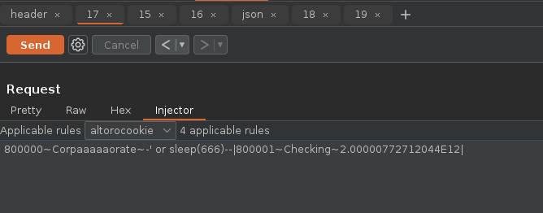

# 💉 Deep Data Injector
Burp Deep Data Injector is a BurpSuite extension that allows pentesters to define targets within non-standard locations 
such as encoded regions or serialized data.

[TL;DR](#TLDR)

For example, let's look at the `AltoroAccounts` cookie within the cookie header of the request below.

```
GET /bank/main.jsp HTTP/1.1
Host: demo.testfire.net
Cookie: JSESSIONID=C446E593634DD2E4942F54E6FB6713FB; AltoroAccounts="ODAwMDAwfkNvcnBvcmF0ZX4tMi4wOTk5NTY0NTM4ODIzOTAxRTEyfDgwMDAwMX5DaGVja2luZ34yLjAwMDAwNzcyNzEyMDQ0RTEyfA=="
User-Agent: curl/7.81.0
Accept: */*
Connection: keep-alive
```

When base64 decoded, the cookie appears as follows:

```
800000~Corporate~-2.0999564538823901E12|800001~Checking~2.00000772712044E12|
```

By default, these potential payload insertion points would not be targeted by the scanner. Burp Deep Data Injector 
provides the ability to target these locations thus improving scan coverage.

# How it works

Burp Deep Data Injector registers itself as a scan insertion point provider using the BurpSuite API. The scanner will 
then present requests to Burp Deep Data Injector to determine if there are any available insertion points. The extension 
will then match the request with any rules defined by the tester and will provide insertion points to the scanner so 
that payloads may be inserted.

### High level work flow
- Create injection rule targeting a previously un-scannable region
- Define a decode and encode script so that the region can be accessed and re-encoded once a payload is inserted
- Run a scan
- The scanner will then pass requests to Burp injector via the `provideInsertionPoints` call to query for insertion points
- The scanner will then call `buildHttpRequestWithPayload` on the provided insertion points to inject payloads

# Targeting methods
There are 3 methods that can be used to target payloads within a decoded region of a request.

### Auto
Targets using pre-canned regexes that match JSON,XML and key value pairs.

### Custom Auto
A custom regex similar to auto target but created by the pentester. A name and value capture group can be provided. The
extension will provide a name if one isn't provided.

### Regex
Regex based targets can be used to target specific areas where 1 single regex isn't ideal.

# Script types
Some target regions may be encoded, serialized or encrypted or signed which means that processing must be done to insert
payloads. Burp Deep Data Injector uses python to handle these operations. There are 3 types of scripts you can provide.

## Decode script
Decodes the target region in which the targets exist. This is called first to "unwrap" the target area.

## Encode script
Re-encodes the target region. This is called once a payload is inserted.

## Payload processing script
Process a payload prior to insertion. This is called on every payload passed to the extension.

### Example script to base64 decode the AltoroMutual cookie shown above

```python
# decoder script used to decode a region of text from a targeting rule
import base64
def decode_target( target: str ) -> str:
	decoded_target = base64.b64decode(target.encode("utf-8")).decode("utf-8")
	return decoded_target
```

### Example script to base64 encode the AltoroMutual cookie shown above
```python
# encoder script used to encode a region of text from a targeting rule after the alteration has been injected
import base64
def encode_target( target: str ) -> str:
	encoded_target = base64.b64encode(target.encode("utf-8")).decode("utf-8")
	return encoded_target
```
By calling the decode script above, the following is revealed

```
800000~Corporate~-2.0999564538823901E12|800001~Checking~2.00000772712044E12|
```

# Example usage
### Create an injection rule
1. Navigate to http://demo.testfire.net
2. Click "Sign in"
3. Login with username `admin` and password `admin`
4. Switch back to the proxy and locate a request to `/bank/main.jsp`, it will have an `AltoroAccounts` cookie which is
a base64 encoded value
5. Right-click on the request and click Extensions → Injector → Send to Deep Data Injector
6. Click the Deep Data Injector tab
7. Click "New" to create a new rule
8. Provide a name and set the rule scope regex to `.*/bank/main.jsp.*`
9. Set the target area regex to `AltoroAccounts="([^"]+)"` and set the capture group to 1
10. Enable the rule
11. Select the "Regex" radio button in the rule editor pane
12. Paste the following in the "Decode" script tab
```python
import base64
def decode_target( target: str ) -> str:
	decoded_target = base64.b64decode(target.encode("utf-8")).decode("utf-8")
	return decoded_target
```
13. Paste the following in the "Encode" script tab
```python
import base64
def encode_target( target: str ) -> str:
	encoded_target = base64.b64encode(target.encode("utf-8")).decode("utf-8")
	return encoded_target
```
14. Click the decode tab and then click "Execute", observe that the payload is now decoded
15. Click "New" ( at the bottom )
16. Create the following targeting rules using the regexes below, set the capture group to 1 for each of them
```
^(\d+)~
^\d+~(.*?)~
^\d+~.*?~(.*?)~
^\d+~.*?~.*?~(.*?)~
^\d+~.*?~.*?~.*?~(.*?)\|
```
17. Click "Save"
18. Run a scan to observe that the targeted region is scanned

### Test your newly created rule
1. Enter a test payload such as `<script>alert(1)</script>` in the test payload field on the "Python script debug" frame
2. Click the "Test" button
3. Click the "Logger" tab and observe that several requests were sent

### Test a request interactively
1. Select any request to `/bank/main.jsp` and send it to the repeater
2. Observe that there is a "Deep Data Injector" editor and that when clicking on it the decoded request is revealed
3. Edit the request and click send.


# Key use cases
- Serialized data
- Encoded data
- Encrypted / signed data
- Non-standard data formats that the scanner doesn't detect by default

# Tips
- Test the rule using the rule test feature to work out any issues prior to scanning
- If the decoded target area ends up being a format such as key value pairs, CSV, JSON or XML then use auto targeting
- Consider developing the bulk of your decode and encode scripts in an IDE and only make minor changes in the script
editor tab since it lacks debugging features that an IDE would have. You can export your scripts by clicking 
"Export scripts" and then you can import them after by clicking "Import scripts"
- The execution time of scripts is shown so you can be mindful of how long your script takes.
- Be mindful of the payload encoding and use a payload processing script to encode when required ( ex: json, xml ) 

# User interface

The main user interface is loaded into a tab


1. Injection rule list
2. Injector rule configuration
3. Regex rule configuration
4. Encode/Decode/Payload scripts
5. Python config / Test payload config / Import script / Export Script / Execute script
6. Script output and debug area
7. Sample request on which the rule is to be run

### An additional user interface is available within the repeater tab


You can use this to interact with payloads using the injector rule processing configuration

# Requirements
- Python 3
- BurpSuite Professional

# Installation
1. Make sure you have a valid python3 installation
2. Download the latest jar from the [releases tab](https://github.com/softwaresecured/burp-injector/releases)
3. In BurpSuite click Extensions → Add and load the file manually

# Demo
1. Clone this repo
2. Switch to the `demo` folder
3. Run `docker build -t pickledemo .` to build the demo app
4. Run the demo app using `docker run -p 5000:5000 pickledemo`
5. Navigate to `http://localhost:5000` in a browser proxied by Burp and follow the instructions

# TL;DR
- Use python to decode areas of requests ( Audit Insertion Points ) that aren't picked up by the scanner
- Run the demo above to test